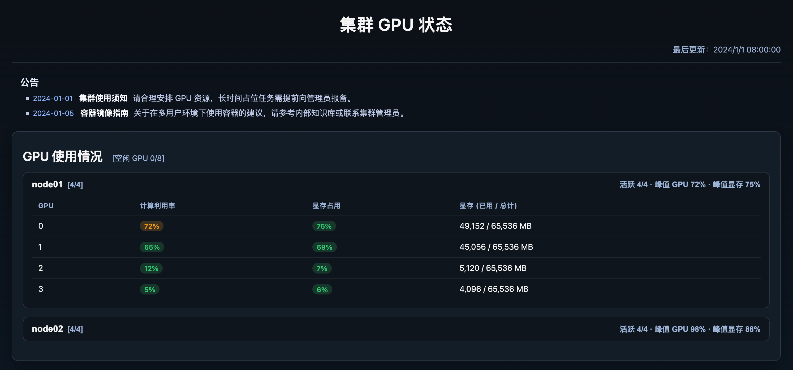
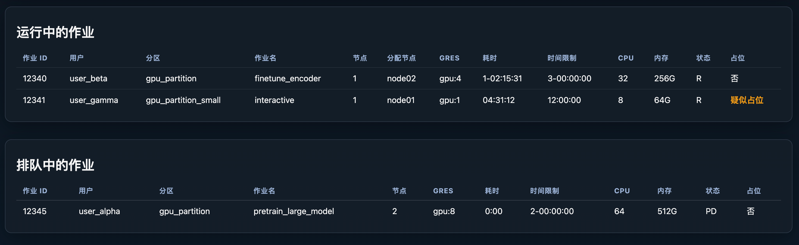
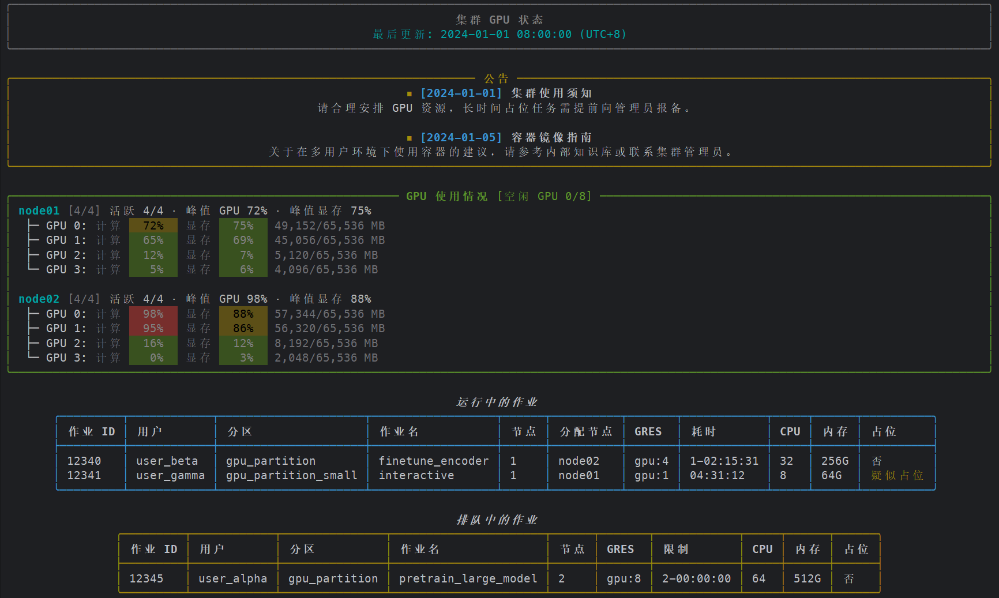

# 🚀 超算 GPU 在线简易管理平台  

一个轻量级的 **SLURM GPU 集群监控方案**：后端脚本以 root 权限定期采集运行/排队作业与节点 GPU 指标，前端静态页只读 JSON 并渲染为仪表盘，便于管理员和普通用户快速掌握资源占用，识别疑似占位任务。  

## 🎯 为什么做这个？

> 💡 **背景与痛点**  
> SLURM 系统中任务管理通常是通过调度系统进行管理，但受限于目前**人多卡少**的情况，有一部分同学会通过提交一些**占卡任务**，调度系统将资源分配之后就无法回收，导致卡越来越少。  
>   
> 这一方面依赖于制定完善的规则，另一方面对于 SLURM 系统的运行状态查询一般是通过命令查询，并且普通用户**无法查看系统当前的运行状态以及各个节点的 GPU 利用率**，难以有效监督。  
>   
> 为了防止 **“劣币驱逐良币”** —— 不遵守规则反而能获取最大利益，我开发了这个简易的 SLURM GPU 管理平台并开源给大家使用。  


## ✨ 功能特点  

- **📊 状态总览**：展示集群剩余 GPU、各节点实时利用率、运行中/排队任务列表。  
- **⚠️ 占位检测**：脚本会检查作业命令，标记疑似占卡行为。  
- **🔒 安全模型**：只需将 JSON 写入共享目录，网页仅需读取权限。  
- **📢 公告模块**：可在 `notices.json` 中维护使用须知或维护通知。  

## 📊 平台预览

### GPU利用率仪表盘


### 任务队列监控


### 命令行查看


## 🚀 快速上手  

### 1. 采集 GPU 状态  

```bash
bash hpc_gpu_status.sh
```

脚本依赖 SLURM `scontrol/sinfo/squeue` 以及节点上的 `nvidia-smi`。如果命令位置或分区名称与默认值不同，可通过环境变量覆盖：  

| 变量名 | 默认值 | 说明 |
| --- | --- | --- |
| `PARTITIONS` | `gpu_partition` | 要监控的分区，多个分区用逗号分隔 |
| `JSON_OUTPUT` | `./gpu_status.json` | 输出 JSON 文件路径 |
| `SLURM_PREFIX` | `/opt/slurm` | SLURM 命令所在前缀目录 |
| `SQUEUE_BIN` / `SINFO_BIN` / `SCONTROL_BIN` | `${SLURM_PREFIX}/bin/...` | 如需使用非默认路径，可单独设置 |
| `SSH_BIN` / `NVIDIA_SMI_BIN` | `ssh` / `nvidia-smi` | 自定义远程命令和 GPU 查询命令 |

**示例**：  

```bash
PARTITIONS=gpu_a,gpu_b \
JSON_OUTPUT=/var/www/html/gpu_status.json \
SLURM_PREFIX=/usr/local/slurm \
bash hpc_gpu_status.sh
```

#### 🔄 持续运行  
使用 `run_per_5_mins.sh` 每 5 分钟刷新一次：  

```bash
bash run_per_5_mins.sh
```

可在 systemd 中结合 `gpu_squeue.service` 部署。该文件提供了模板写法，可按需修改 `User`、`Environment` 及脚本路径：  

```ini
[Service]
Environment="TARGET_SCRIPT=/opt/hpc_monitor/hpc_gpu_status.sh"
ExecStart=/usr/bin/bash /opt/hpc_monitor/run_per_5_mins.sh
```

### 2. 部署前端 🌐  

前端是单页静态文件，任何静态服务器即可：  

```bash
python -m http.server --directory ./ 9811
```

把 `gpu_status.json` 与 `notices.json` 放在与 `index.html` 相同目录或可被前端访问的路径，即可通过浏览器或 VS Code 端口转发访问。也可以使用 Nginx 等服务暴露到公网。  

### 3. 命令行查看 📋  

也可执行python脚本在命令行中输出：  

```bash
pip install rich
python -m display_status \
  --status-file ./gpu_status.json \
  --notices-file ./notices.json \
  --console-width 150
```

## ⚠️ 注意事项  

- 🧪 仓库内 `gpu_status.json`、`notices.json` 为示例数据，仅用于展示前端效果；上线前请用真实采集结果覆盖。  
- 🔑 采集脚本需要能够通过 SSH 访问节点运行 `nvidia-smi`，请确保相应账号和免密配置正确。  
- 🛠️ 若要扩展更多字段，可直接修改脚本输出 JSON 结构，前端使用原生 JS 渲染，便于按需调整。  


## 🌟 让我们一起快乐的炼丹吧！  


💪 让资源透明，让使用更公平，让科研更高效！  
